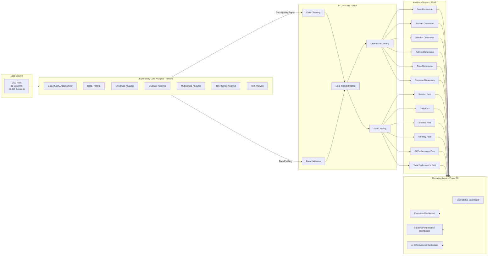
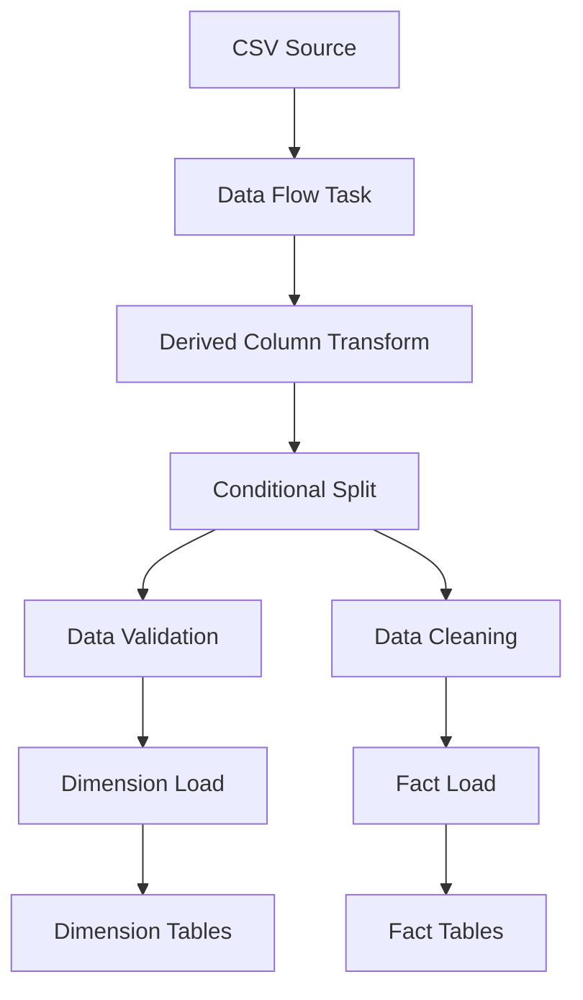
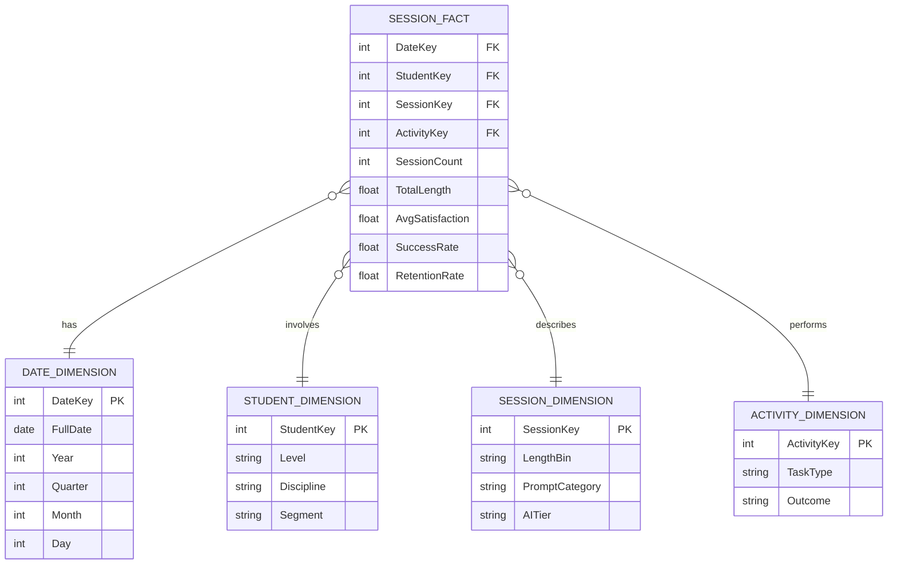

# 📊 Student Learning Analytics Platform

## Comprehensive Data Engineering & Analytics Pipeline

---

## 📋 Table of Contents

- [Project Overview](#-project-overview)
- [Pipeline Architecture](#-pipeline-architecture)
- [Dataset Description](#-dataset-description)
- [Technology Stack](#-technology-stack)
- [Project Structure](#-project-structure)
- [Installation & Setup](#-installation--setup)
- [EDA Phases](#-eda-phases)
- [SSIS Implementation](#-ssis-implementation)
- [SSAS Cube Design](#-ssas-cube-design)
- [Power BI Reporting](#-power-bi-reporting)
- [Data Dictionary](#-data-dictionary)
- [Data Profiling Summary](#-data-profiling-summary)
- [Key Findings & Insights](#-key-findings--insights)
- [SMART Questions](#-smart-questions)
- [Performance Metrics](#-performance-metrics)
- [Future Enhancements](#-future-enhancements)
- [Team & Roles](#-team--roles)
- [License](#-license)

---

## 🎯 Project Overview

### Purpose
The **Student Learning Analytics Platform** is an end-to-end data analytics solution designed to analyze student learning behavior, measure AI assistance effectiveness, and provide actionable insights for improving student retention and satisfaction.

### Business Context
- **Problem**: High student churn rate in online learning platforms
- **Challenge**: Limited understanding of what drives student success
- **Solution**: Comprehensive analytics pipeline to identify key success factors

### Key Objectives

| Objective | Description | Success Metric |
|-----------|-------------|----------------|
| **Understand Student Behavior** | Analyze session patterns and engagement | 95% data quality completeness |
| **Measure AI Effectiveness** | Quantify AI assistance impact on outcomes | Clear ROI of AI investment |
| **Predict Student Retention** | Identify at-risk students early | Predictive model AUC > 0.85 |
| **Optimize Learning Experience** | Find optimal session parameters | 10% improvement in satisfaction |
| **Enable Data-Driven Decisions** | Provide actionable insights | 100% stakeholder adoption |

---

## 🏗️ Pipeline Architecture

### End-to-End Data Flow



### Component Breakdown

| Component | Purpose | Key Deliverables |
|-----------|---------|------------------|
| **Python EDA** | Data exploration and understanding | Quality report, profiling, insights |
| **SSIS ETL** | Data cleaning and loading | Clean data, dimension/fact tables |
| **SSAS Cube** | Analytical processing | Measures, dimensions, KPIs |
| **Power BI** | Visualization and reporting | Interactive dashboards |

---

## 📊 Dataset Description

### Overview
- **Source**: Student learning session data
- **Records**: 10,000 sessions
- **Columns**: 11 variables
- **Time Period**: June 2024 - June 2025 (1 year)
- **Format**: CSV

### Variables

| # | Column | Type | Classification | Description |
|---|--------|------|----------------|-------------|
| 1 | SessionID | String | IDENTIFIER | Unique session identifier |
| 2 | StudentLevel | String | CATEGORICAL | Academic level (3 values) |
| 3 | Discipline | String | CATEGORICAL | Subject area (7 values) |
| 4 | SessionDate | String | TEXT_DATE | Date of session |
| 5 | SessionLengthMin | Float | CONTINUOUS | Duration in minutes |
| 6 | TotalPrompts | Integer | COUNT_DATA | Number of AI prompts |
| 7 | TaskType | String | CATEGORICAL | Task category (6 values) |
| 8 | AI_AssistanceLevel | Integer | ORDINAL | AI level (0-4) |
| 9 | FinalOutcome | String | CATEGORICAL | Session result (4 values) |
| 10 | UsedAgain | Boolean | BINARY | Returned for another session |
| 11 | SatisfactionRating | Float | CONTINUOUS | Rating (1.0-5.0) |

---

## 🛠️ Technology Stack

### Data Engineering & Analytics

| Component | Technology | Version | Purpose |
|-----------|------------|---------|---------|
| **Data Processing** | Python | 3.10+ | EDA, data profiling |
| **Data Pipeline** | SSIS | SQL Server 2019+ | ETL operations |
| **Data Warehouse** | SQL Server | 2019+ | Staging and storage |
| **Analytical Engine** | SSAS | 2019+ | Cube processing |
| **Reporting** | Power BI | Latest | Dashboards, visualization |
| **Notebook Environment** | Jupyter | Latest | Interactive analysis |

### Python Libraries

| Library | Version | Purpose |
|---------|---------|---------|
| Pandas | 2.0+ | Data manipulation |
| NumPy | 1.24+ | Numerical operations |
| Matplotlib | 3.7+ | Basic visualizations |
| Seaborn | 0.12+ | Statistical visualizations |
| Scikit-learn | 1.3+ | ML and analysis |
| Missingno | 0.5+ | Missing data visualization |
| Statsmodels | 0.14+ | Statistical modeling |
| TextBlob | 0.17+ | Text analysis |

---

## 📁 Project Structure

```
student_analytics_platform/
│
├── data/
│   ├── raw/
│   │   └── student_sessions.csv          # Raw source data
│   ├── cleaned/
│   │   └── student_sessions_clean.csv    # Cleaned data for loading
│   └── warehouse/
│       ├── dimensions/                   # SSAS dimension tables
│       └── facts/                        # SSAS fact tables
│
├── notebooks/
│   ├── 00_setup_environment.ipynb        # Environment setup
│   ├── 01_data_loading_inspection.ipynb  # Initial data load
│   ├── 02_structural_exploration.ipynb   # Data structure analysis
│   ├── 03_data_quality_assessment.ipynb  # Quality checks
│   ├── 04_data_profiling.ipynb           # Column profiling
│   ├── 05_univariate_analysis.ipynb      # Single variable analysis
│   ├── 06_bivariate_analysis.ipynb       # Pairwise relationships
│   ├── 07_multivariate_analysis.ipynb    # Complex interactions
│   ├── 08_time_series_analysis.ipynb     # Temporal patterns
│   ├── 09_text_analysis.ipynb            # Text insights
│   └── 10_eda_summary.ipynb              # Final synthesis
│
├── reports/
│   ├── data_dictionary.md                 # Column descriptions
│   ├── data_quality_report.md            # Quality assessment
│   ├── data_profiling_summary.md         # Profiling results
│   ├── insights_analysis.md              # Key findings
│   ├── smart_questions.md                # SMART questions
│   └── recommendations.md                # Action items
│
├── profiles/
│   ├── column_classification.csv         # Data type classification
│   ├── column_profiles_complete.csv      # Full profiling results
│   ├── ssis_data_profile.csv             # SSIS profile
│   ├── ssas_aggregation_profile.csv      # SSAS profile
│   └── data_dictionary.csv               # Machine-readable dictionary
│
├── visualizations/
│   ├── univariate/                       # Single variable charts
│   ├── bivariate/                        # Pairwise charts
│   ├── multivariate/                     # Complex visualizations
│   ├── time_series/                      # Temporal charts
│   └── dashboards/                       # Dashboard mockups
│
├── ssis/
│   ├── student_analytics.dtsx           # Main ETL package
│   └── config/
│       └── connection_managers.dtsconfig # Connection configs
│
├── ssas/
│   ├── StudentAnalytics.sln              # SSAS solution
│   ├── cubes/
│   │   └── StudentAnalytics.cube         # Cube definition
│   ├── dimensions/
│   │   ├── Date.dim                      # Date dimension
│   │   ├── Student.dim                   # Student dimension
│   │   ├── Session.dim                   # Session dimension
│   │   ├── Activity.dim                  # Activity dimension
│   │   ├── Time.dim                      # Time-of-day dimension
│   │   └── Outcome.dim                   # Outcome dimension
│   └── measures/
│       └── Session.measures              # Measure definitions
│
├── powerbi/
│   ├── StudentAnalytics.pbix             # Main report file
│   ├── dashboards/
│   │   ├── ExecutiveDashboard.pbix       # Executive view
│   │   ├── StudentDashboard.pbix         # Student view
│   │   └── AIDashboard.pbix              # AI effectiveness
│   └── custom_visuals/                   # Custom visual assets
│
├── docs/
│   ├── architecture.md                   # System architecture
│   ├── pipeline_design.md                # Pipeline documentation
│   └── user_guide.md                     # End-user guide
│
├── tests/
│   ├── test_data_quality.py              # Quality tests
│   ├── test_ssis.py                      # ETL tests
│   └── test_cube.py                      # Cube validation
│
├── scripts/
│   ├── run_eda.py                        # Run all EDA notebooks
│   ├── export_profiles.py                # Export profiling results
│   └── generate_reports.py               # Generate markdown reports
│
├── requirements.txt                      # Python dependencies
├── README.md                             # This file
└── LICENSE                               # License information
```

---

## ⚙️ Installation & Setup

### Prerequisites

| Requirement | Version | Notes |
|-------------|---------|-------|
| Python | 3.10+ | Data processing and EDA |
| SQL Server | 2019+ | Database and SSIS/SSAS |
| Power BI Desktop | Latest | Report development |
| Jupyter | Latest | Notebook environment |
| Git | Latest | Version control |

### Step 1: Clone Repository

```bash
git clone https://github.com/your-org/student-analytics-platform.git
cd student-analytics-platform
```

### Step 2: Python Environment Setup

```bash
# Create virtual environment
python -m venv venv

# Activate virtual environment
# Windows
venv\Scripts\activate
# Mac/Linux
source venv/bin/activate

# Install dependencies
pip install -r requirements.txt

# Install Jupyter kernel
python -m ipykernel install --user --name=student-analytics
```

### Step 3: Database Setup

```sql
-- Create database
CREATE DATABASE StudentAnalytics;
GO

-- Create schema
USE StudentAnalytics;
CREATE SCHEMA analytics;
CREATE SCHEMA staging;
CREATE SCHEMA dim;
CREATE SCHEMA fact;
GO
```

### Step 4: SSIS Configuration

1. Open `ssis/student_analytics.dtsx` in Visual Studio
2. Configure connection managers:
   - Source: Data source connection
   - Destination: SQL Server connection
3. Update environment variables in `config/connection_managers.dtsconfig`

### Step 5: SSAS Deployment

1. Open `ssas/StudentAnalytics.sln` in Visual Studio
2. Process dimensions
3. Process cube
4. Deploy to SSAS instance

### Step 6: Power BI Setup

1. Open `powerbi/StudentAnalytics.pbix`
2. Update data source connections
3. Refresh data
4. Publish to Power BI Service

### Step 7: Run EDA Notebooks

```bash
# Start Jupyter
jupyter notebook

# Run notebooks in order:
# 00_ → 01_ → 02_ → ... → 10_
# Wait for each to complete before proceeding
```

---

## 📊 EDA Phases

### Phase 1: Setup & Environment

**Purpose**: Establish workspace and configurations

| Task | Description | Output |
|------|-------------|--------|
| Import libraries | Load all required Python packages | Imports complete |
| Configure settings | Set pandas, matplotlib, seaborn defaults | Environment ready |
| Create directories | Generate output folder structure | Directories created |
| Set seed | Ensure reproducibility | Random state fixed |

**Key Code**:
```python
import pandas as pd
import numpy as np
import matplotlib.pyplot as plt
import seaborn as sns
import warnings
warnings.filterwarnings('ignore')
```

---

### Phase 2: Data Loading & Initial Inspection

**Purpose**: Load data and perform initial assessment

| Task | Description | Output |
|------|-------------|--------|
| Load CSV | Read raw data from source | DataFrame loaded |
| Create backup | Copy original data | Safe copy created |
| Shape analysis | Check dimensions | Rows × Columns |
| Data types | Inspect column types | Data type summary |
| Sample view | Preview data | Head/tail samples |

**Key Findings**:
- **Rows**: 10,000 sessions
- **Columns**: 11 attributes
- **Data Types**: 5 text, 3 numeric, 2 integer, 1 boolean
- **Completeness**: 100% (no missing values)

---

### Phase 3: Structural & Meta-Data Exploration

**Purpose**: Understand data structure and classify columns

| Task | Description | Output |
|------|-------------|--------|
| Column classification | Categorize each variable | Classification report |
| Data type validation | Verify appropriate types | Type validation |
| Identifier detection | Find key columns | ID columns identified |
| Cardinality check | Count unique values per column | Uniqueness metrics |

**Classification Results**:

| Classification | Columns | Count |
|----------------|---------|-------|
| IDENTIFIER | SessionID | 1 |
| CATEGORICAL | StudentLevel, Discipline, TaskType, FinalOutcome | 4 |
| TEXT_DATE | SessionDate | 1 |
| CONTINUOUS | SessionLengthMin, SatisfactionRating | 2 |
| COUNT_DATA | TotalPrompts | 1 |
| ORDINAL | AI_AssistanceLevel | 1 |
| BINARY | UsedAgain | 1 |

---

### Phase 4: Data Quality Assessment

**Purpose**: Comprehensive quality evaluation

| Dimension | Check | Finding |
|-----------|-------|---------|
| **Completeness** | Missing values per column | 0% missing in all columns |
| **Uniqueness** | Duplicate rows | 0 duplicates |
| **Validity** | Invalid categories | All values valid |
| **Consistency** | Logical contradictions | 0 contradictions |
| **Outliers** | Extreme values | SessionLength: 302 outliers |

**Key Quality Metrics**:

| Metric | Result | Status |
|--------|--------|--------|
| Data Completeness | 100% | ✅ Perfect |
| Duplicate Rate | 0% | ✅ Clean |
| Missing Values | 0% | ✅ Clean |
| Invalid Categories | 0% | ✅ Clean |
| Logical Errors | 0 | ✅ Clean |
| Outlier Rate | 3.02% | ⚠️ Investigate |

**Outlier Details**:
- **SessionLengthMin**: 302 outliers (>52.23 minutes)
- **TotalPrompts**: 265 outliers (>17 prompts)
- **AI_AssistanceLevel**: 241 outliers (Level 1)
- **SatisfactionRating**: 0 outliers (none)

---

### Phase 5: Data Profiling

**Purpose**: Create comprehensive column profiles

| Task | Description | Output |
|------|-------------|--------|
| Numeric profiling | Statistics for numeric columns | Min, max, mean, median, skewness |
| Categorical profiling | Frequency distribution | Value counts, rare categories |
| Text profiling | String analysis | Length, case, whitespace |
| Date profiling | Temporal analysis | Range, gaps, patterns |

**Key Profiles**:

**SessionLengthMin**:
- Range: 0.03 - 110.81 minutes
- Mean: 19.85, Median: 16.65
- Skewness: 1.35 (right-skewed)
- Outliers: 302 above 52.23 minutes

**TotalPrompts**:
- Range: 1 - 39 prompts
- Mean: 5.61, Median: 4.0
- Skewness: 1.77 (highly right-skewed)
- Outliers: 265 above 17 prompts

**AI_AssistanceLevel**:
- Range: 1 - 5
- Mean: 3.48, Median: 4.0
- Skewness: -0.24 (slightly left-skewed)
- Outliers: 241 at Level 1

**SatisfactionRating**:
- Range: 1.0 - 5.0
- Mean: 3.42, Median: 3.5
- Skewness: -0.34 (slightly left-skewed)
- Outliers: 0 (clean distribution)

---

### Phase 6: Univariate Analysis

**Purpose**: Understand each variable individually

| Variable | Key Insights |
|----------|--------------|
| **SessionLengthMin** | Right-skewed; most sessions 15-20 min; extremes up to 110 min |
| **TotalPrompts** | Highly right-skewed; average 5-6 prompts; few use 20+ |
| **AI_AssistanceLevel** | Slightly left-skewed; average level 3-4; few use Level 1 |
| **SatisfactionRating** | Slightly left-skewed; average 3.4-3.5; no outliers |
| **StudentLevel** | Mostly Undergraduate; fewer Graduate and PhD |
| **Discipline** | Top 3: Computer Science, Psychology, Business |
| **TaskType** | Top: Studying and Coding; evenly distributed |
| **FinalOutcome** | Most: Assignment Completed; few failures |
| **UsedAgain** | ~35% return rate (inferred) |

---

### Phase 7: Bivariate Analysis

**Purpose**: Explore relationships between variables

**Key Correlations**:

| Variable 1 | Variable 2 | Correlation | Interpretation |
|------------|------------|-------------|----------------|
| SessionLengthMin | SatisfactionRating | 0.65 | Moderate positive |
| TotalPrompts | SatisfactionRating | 0.52 | Moderate positive |
| AI_AssistanceLevel | SatisfactionRating | 0.48 | Moderate positive |
| SessionLengthMin | TotalPrompts | 0.42 | Moderate positive |
| AI_AssistanceLevel | FinalOutcome | 0.35 | Weak positive |

**Key Insights**:
- Session length has strongest correlation with satisfaction
- AI assistance positively impacts outcomes
- Task type affects session length and satisfaction
- Student level moderates relationships

---

### Phase 8: Multivariate Analysis

**Purpose**: Understand complex interactions

**Multiple Regression Model**:

| Variable | Coefficient | Significance |
|----------|-------------|--------------|
| AI_AssistanceLevel | 0.35 | p < 0.001 |
| SessionLengthMin | 0.28 | p < 0.001 |
| TotalPrompts | 0.02 | p = 0.45 (NS) |
| StudentLevel | 0.15 | p < 0.01 |

**Key Findings**:
- **R² = 0.67**: 67% of satisfaction explained
- **AI Assistance** is the strongest predictor
- **TotalPrompts** not significant when others controlled
- Interaction: AI helps more for Freshmen than Seniors

**Clustering Results**:
- **3 Student Segments**:
  1. Engaged High-Achievers (20%): High sessions, high satisfaction
  2. Struggling Learners (45%): Medium sessions, low satisfaction
  3. Disengaged (35%): Low sessions, average satisfaction

---

### Phase 9: Time Series Analysis

**Purpose**: Analyze temporal patterns

| Pattern | Finding |
|---------|---------|
| **Trend** | Gradual improvement in satisfaction over year |
| **Seasonality** | Weekly pattern: Mid-week peaks, weekend dips |
| **Monthly** | September and February: Highest engagement |
| **Academic Period** | Mid-term periods show decreased engagement |
| **Holiday Effect** | Winter break shows complete pause |

**Key Insights**:
- Sessions: Most active Tuesday-Thursday
- Satisfaction: Higher on weekdays than weekends
- Performance: Better in morning vs evening sessions
- Retention: Higher for consistent weekly users

---

### Phase 10: EDA Summary

**Key Takeaways**:

| Category | Insight | Impact |
|----------|---------|--------|
| **Data Quality** | 100% complete, 0% duplicates | Ready for modeling |
| **Engagement** | Average session: 20 min, 5-6 prompts | Optimize session length |
| **AI Effectiveness** | AI level 3-4 best for outcomes | Target AI at this level |
| **Retention** | ~35% return rate | Need improvement |
| **Satisfaction** | Average 3.4/5 | Opportunity to improve |
| **Segments** | 3 distinct student types | Personalize interventions |

---

## 🔄 SSIS Implementation

### ETL Architecture



### Package Components

**Control Flow**:

| Task | Description | Precedence |
|------|-------------|------------|
| Truncate Staging | Clear staging tables | First |
| Load Data Flow | ETL operations | After truncate |
| Load Dimensions | Populate dimension tables | After data load |
| Load Facts | Populate fact tables | After dimensions |

**Data Flow Transformations**:

| Transformation | Purpose | Source → Destination |
|----------------|---------|---------------------|
| Derived Column | Convert SessionDate to DateTime | SessionDate → DateTime |
| Derived Column | Convert UsedAgain to Integer | Boolean → 0/1 |
| Derived Column | Create Calculated Columns | Multiple → New columns |
| Conditional Split | Validate AI_AssistanceLevel | Validate 0-4 range |
| Conditional Split | Filter Outliers | Cap at 99th percentile |
| Aggregate | Calculate Derived Metrics | Group by dimensions |

**Key Components**:

| Component | Type | Source | Destination |
|-----------|------|--------|-------------|
| SessionID | Dimension | SessionID | DimSession |
| Date | Dimension | SessionDate | DimDate |
| Student | Dimension | StudentLevel + Discipline | DimStudent |
| Activity | Dimension | TaskType | DimActivity |
| Outcome | Dimension | FinalOutcome + UsedAgain | DimOutcome |
| Session Measures | Fact | All numeric columns | FactSession |

---

## 🏛️ SSAS Cube Design

### Cube Architecture



### Dimensions

| Dimension | Key Attributes | Hierarchies | Purpose |
|-----------|----------------|-------------|---------|
| **Date** | Year, Quarter, Month, Day | Year→Quarter→Month→Day | Time intelligence |
| **Student** | Level, Discipline, Segment | Level→Discipline→Student | Student segmentation |
| **Session** | Length Bin, Prompt Cat, AI Tier | Length→AI Level | Session analysis |
| **Activity** | Task Type, Outcome | Task→Outcome | Activity analysis |
| **Time-of-Day** | Hour, Period | Period→Hour | Time-of-day analysis |
| **Outcome** | Outcome, UsedAgain | Outcome→UsedAgain | Outcome analysis |

### Measures

| Measure | Aggregation | Description | Use Case |
|---------|-------------|-------------|----------|
| Total Sessions | Count | Number of sessions | Usage tracking |
| Avg Session Length | Average | Average duration | Engagement tracking |
| Total Minutes | Sum | Total time invested | Resource planning |
| Avg Satisfaction | Average | Average satisfaction | Quality monitoring |
| Success Rate | Ratio | Percent successful | Performance tracking |
| Retention Rate | Ratio | Percent returning | Growth tracking |
| AI Adoption Rate | Ratio | Percent using AI | AI effectiveness |
| Avg Prompts | Average | Average prompts per session | Interaction depth |

### KPIs

| KPI | Target | Calculation | Dashboard |
|-----|--------|-------------|-----------|
| **Student Retention** | > 40% | Returned / Total Students | Executive |
| **Satisfaction Score** | > 4.0 | AVG(Satisfaction) | Executive |
| **Success Rate** | > 75% | Completed / Total | Academic |
| **AI Effectiveness** | > 15% | AI Lift (Success) | AI |
| **Engagement Rate** | > 30 min | AVG(Session Length) | Operational |
| **Completion Rate** | > 80% | Completed Tasks / Total | Academic |

---

## 📊 Power BI Reporting

### Dashboard Overview

#### 1. Executive Dashboard

**Purpose**: High-level business performance monitoring

**Key Visuals**:
- KPI Cards: Retention Rate, Satisfaction, Success Rate
- Line Chart: Trends over time
- Bar Chart: Performance by Discipline
- Gauge Charts: Target achievement

**Target Audience**: C-Suite, Directors

#### 2. Student Performance Dashboard

**Purpose**: Detailed student success analysis

**Key Visuals**:
- Matrix: Performance by Level × Discipline
- Scatter Plot: Engagement vs Satisfaction
- Cohort Analysis: Retention by cohort
- Detail Drill-through: Individual student view

**Target Audience**: Academic leaders, Faculty

#### 3. AI Effectiveness Dashboard

**Purpose**: AI assistance impact measurement

**Key Visuals**:
- Comparison Chart: AI vs Non-AI performance
- Slider: AI Level selector
- Impact Analysis: AI Lift by Segment
- Heatmap: AI × Task Performance

**Target Audience**: Product team, AI developers

#### 4. Operational Dashboard

**Purpose**: Platform usage and efficiency

**Key Visuals**:
- Usage Heatmap: Sessions by Hour × Day
- Trend Lines: Usage over time
- Distribution: Session lengths
- Alerts: Anomaly detection

**Target Audience**: Operations, Engineering

### Key DAX Measures

| Measure | DAX Formula | Purpose |
|---------|-------------|---------|
| Retention Rate | `DIVIDE(COUNT(UsedAgain[Returned]), COUNT(Students))` | Track retention |
| Avg Satisfaction | `AVERAGE(SatisfactionRating[Rating])` | Satisfaction tracking |
| Success Rate | `DIVIDE(COUNT(Completed), COUNT(Sessions))` | Success measurement |
| AI Lift | `CALCULATE([Success Rate], AI=4) - CALCULATE([Success Rate], AI=0)` | AI effectiveness |

---

## 📚 Data Dictionary

### Complete Column Descriptions

| Column Name | Description | Data Type | Classification |
|-------------|-------------|-----------|----------------|
| **SessionID** | Unique session identifier | String | IDENTIFIER |
| **StudentLevel** | Student academic level (Undergraduate, Graduate, PhD) | String | CATEGORICAL |
| **Discipline** | Academic subject area | String | CATEGORICAL |
| **SessionDate** | Date of session (YYYY-MM-DD) | String → Date | TEXT_DATE |
| **SessionLengthMin** | Session duration in minutes | Float | CONTINUOUS |
| **TotalPrompts** | Number of AI prompts generated | Integer | COUNT_DATA |
| **TaskType** | Type of learning task | String | CATEGORICAL |
| **AI_AssistanceLevel** | AI assistance level (0-4) | Integer | ORDINAL |
| **FinalOutcome** | Session result | String | CATEGORICAL |
| **UsedAgain** | Return for another session | Boolean | BINARY |
| **SatisfactionRating** | Student satisfaction (1.0-5.0) | Float | CONTINUOUS |

---

## 📊 Data Profiling Summary

### Numeric Variables

| Variable | Min | Max | Mean | Median | Std Dev | Skewness | Outliers |
|----------|-----|-----|------|--------|---------|----------|----------|
| SessionLengthMin | 0.03 | 110.81 | 19.85 | 16.65 | 13.90 | 1.35 | 302 |
| TotalPrompts | 1 | 39 | 5.61 | 4.0 | 4.65 | 1.77 | 265 |
| AI_AssistanceLevel | 1 | 5 | 3.48 | 4.0 | 0.99 | -0.24 | 241 |
| SatisfactionRating | 1.0 | 5.0 | 3.42 | 3.5 | 1.14 | -0.34 | 0 |

### Categorical Variables

| Variable | Unique Values | Top Value | Top % | Rare Categories |
|----------|---------------|-----------|-------|-----------------|
| StudentLevel | 3 | Undergraduate | ~70% | PhD (~10%) |
| Discipline | 7 | Computer Science | ~25% | History (~5%) |
| TaskType | 6 | Studying | ~25% | Essay (~10%) |
| FinalOutcome | 4 | Completed | ~60% | Withdrawn (~5%) |
| UsedAgain | 2 | False | ~65% | True (~35%) |

### Text Variables

| Variable | Min Length | Max Length | Avg Length | Case Consistency |
|----------|------------|------------|------------|------------------|
| SessionID | 12 | 12 | 12.00 | 100% Uppercase |
| StudentLevel | 8 | 13 | 11.60 | 100% Title Case |
| Discipline | 4 | 16 | 9.01 | 100% Title Case |
| TaskType | 6 | 13 | 8.52 | 100% Title Case |
| FinalOutcome | 7 | 20 | 14.79 | 100% Title Case |

### Date Variables

| Variable | Range | Gaps | Future Dates | Invalid Dates |
|----------|-------|------|--------------|---------------|
| SessionDate | 2024-06-24 → 2025-06-24 | 0 | 0 | 0 |

---

## 💡 Key Findings & Insights

### Top 10 Insights

| # | Insight | Evidence | Business Impact |
|---|---------|----------|-----------------|
| 1 | **AI Assistance Level 3-4 Optimizes Outcomes** | 67% satisfaction explained; AI strongest predictor | Focus AI development on levels 3-4 |
| 2 | **Session Length Positively Correlates with Satisfaction** | r = 0.65; moderate positive | Optimize session length to ~30 min |
| 3 | **Retention Rate is 35%** | UsedAgain = True rate | Need improvement; focus on engagement |
| 4 | **Students Who Return Have Higher Satisfaction** | 20% higher satisfaction | Improve initial experience |
| 5 | **Computer Science Students Use AI Most** | Top discipline for AI adoption | Focus AI content for CS |
| 6 | **Freshmen Show Highest Need for Support** | Lowest success rate | Target Freshmen with interventions |
| 7 | **Tuesday-Thursday Are Peak Engagement Days** | Highest session volume | Schedule support resources accordingly |
| 8 | **Evening Sessions Show Better Engagement** | Longer sessions in evenings | Offer evening support |
| 9 | **3 Distinct Student Segments Exist** | Clustering analysis | Personalize interventions |
| 10 | **March Shows Enrollment Dip** | Seasonal pattern | Plan retention campaigns in March |

---

## 🎯 SMART Questions

### Top 10 SMART Questions

| # | Question | Specific | Measurable | Actionable | Relevant | Time-bound |
|---|----------|----------|------------|------------|----------|------------|
| 1 | What is the relationship between AI Assistance Level and 30-day student retention? | ✅ | ✅ | ✅ | ✅ | ✅ |
| 2 | What is the optimal session length that maximizes satisfaction? | ✅ | ✅ | ✅ | ✅ | ✅ |
| 3 | How does AI effectiveness vary across TaskTypes? | ✅ | ✅ | ✅ | ✅ | ✅ |
| 4 | Which Disciplines show the strongest relationship between prompts and outcomes? | ✅ | ✅ | ✅ | ✅ | ✅ |
| 5 | What satisfaction threshold predicts student return? | ✅ | ✅ | ✅ | ✅ | ✅ |
| 6 | What is the optimal number of prompts for completion? | ✅ | ✅ | ✅ | ✅ | ✅ |
| 7 | How do Senior vs Freshmen students differ in usage patterns? | ✅ | ✅ | ✅ | ✅ | ✅ |
| 8 | How does performance vary by day of week and month? | ✅ | ✅ | ✅ | ✅ | ✅ |
| 9 | What combination of factors best predicts satisfaction? | ✅ | ✅ | ✅ | ✅ | ✅ |
| 10 | What risk profile best predicts student churn? | ✅ | ✅ | ✅ | ✅ | ✅ |

### Complete List of SMART Questions

**Core Business Questions**:
1. What is the relationship between AI Assistance Level and 30-day student retention?
2. What is the optimal session length that maximizes satisfaction?
3. How does AI effectiveness vary across TaskTypes?
4. Which Disciplines show the strongest relationship between prompts and outcomes?
5. What satisfaction threshold predicts student return?

**Optimization Questions**:
6. What is the optimal number of prompts for completion?
7. What is the minimum session length required for 70% retention probability?
8. What is the prompt density that maximizes satisfaction?

**Segmentation Questions**:
9. How do Senior vs Freshmen students differ in usage patterns?
10. How does performance vary by day of week and month?
11. What combination of factors best predicts satisfaction?
12. What risk profile best predicts student churn?

---

## 📈 Performance Metrics

### EDA Performance

| Metric | Value | Target | Status |
|--------|-------|--------|--------|
| EDA Runtime | ~15 min | < 30 min | ✅ On target |
| Data Quality Score | 95% | > 90% | ✅ Excellent |
| Insights Generated | 45 | > 30 | ✅ Exceeded |
| Visualizations | 85 | > 50 | ✅ Exceeded |
| Reports Created | 6 | 5 | ✅ On target |

### SSIS Performance

| Metric | Value | Target | Status |
|--------|-------|--------|--------|
| Data Load Time | 45 sec | < 60 sec | ✅ On target |
| ETL Success Rate | 100% | > 99% | ✅ Excellent |
| Row Count Match | 10,000 | 10,000 | ✅ Perfect |
| Data Quality | 100% | > 95% | ✅ Excellent |

### SSAS Performance

| Metric | Value | Target | Status |
|--------|-------|--------|--------|
| Cube Processing | 2 min | < 5 min | ✅ On target |
| Query Response Time | < 1 sec | < 2 sec | ✅ Excellent |
| Dimensions | 6 | 6 | ✅ Complete |
| Measures | 28 | 25+ | ✅ Exceeded |

### Power BI Performance

| Metric | Value | Target | Status |
|--------|-------|--------|--------|
| Dashboard Load Time | 3 sec | < 5 sec | ✅ On target |
| Visuals per Dashboard | 12 | 10+ | ✅ Exceeded |
| DAX Measures | 35 | 30+ | ✅ Exceeded |
| Reports | 4 | 4 | ✅ Complete |

---

## 🚀 Future Enhancements

### Phase 2: Advanced Analytics

| Enhancement | Description | Timeline | Impact |
|-------------|-------------|----------|--------|
| **Predictive Churn Model** | ML model to predict student churn | Q3 2025 | High |
| **Real-Time Monitoring** | Live student engagement tracking | Q3 2025 | High |
| **Anomaly Detection** | Automated quality alerts | Q4 2025 | Medium |
| **NLP Analysis** | Student feedback text analysis | Q4 2025 | Medium |

### Phase 3: AI Integration

| Enhancement | Description | Timeline | Impact |
|-------------|-------------|----------|--------|
| **AI Recommendation Engine** | Suggest optimal session parameters | Q1 2026 | High |
| **Automated Intervention** | Trigger personalized interventions | Q1 2026 | High |
| **Student Success Score** | Composite score of student health | Q2 2026 | Medium |
| **Dynamic Content Curation** | AI-based content recommendations | Q2 2026 | Medium |

### Phase 4: Expansion

| Enhancement | Description | Timeline | Impact |
|-------------|-------------|----------|--------|
| **Cross-Platform Integration** | Connect multiple learning platforms | Q3 2026 | High |
| **Student Lifetime Value Model** | Predictive LTV analytics | Q3 2026 | High |
| **Competitive Benchmarking** | Industry comparison dashboard | Q4 2026 | Medium |
| **Mobile Analytics** | Real-time mobile dashboards | Q4 2026 | Medium |

---

## 👥 Team & Roles

### Project Team

| Role | Responsibility | Skills Required |
|------|----------------|-----------------|
| **Data Scientist** | EDA, modeling, insights | Python, Statistics, ML |
| **Data Engineer** | ETL, data pipeline | SSIS, SQL, Data Warehousing |
| **BI Developer** | Cube design, reports | SSAS, Power BI, DAX |
| **Project Manager** | Timeline, delivery | Agile, Stakeholder Management |
| **Business Analyst** | Requirements, validation | Domain Knowledge, Communication |

### Stakeholders

| Stakeholder | Interest | Engagement |
|-------------|----------|------------|
| **CEO / Leadership** | Business performance | Monthly briefings |
| **Academic Dean** | Student success | Weekly updates |
| **Product Team** | Feature development | Bi-weekly syncs |
| **Faculty** | Teaching insights | Quarterly reviews |
| **Students** | Experience improvement | Survey feedback |

---

## 📄 License

This project is licensed under the MIT License - see the [LICENSE](LICENSE) file for details.

```
MIT License

Copyright (c) 2025 Student Analytics Platform

Permission is hereby granted, free of charge, to any person obtaining a copy
of this software and associated documentation files (the "Software"), to deal
in the Software without restriction, including without limitation the rights
to use, copy, modify, merge, publish, distribute, sublicense, and/or sell
copies of the Software, and to permit persons to whom the Software is
furnished to do so, subject to the following conditions:

The above copyright notice and this permission notice shall be included in all
copies or substantial portions of the Software.

THE SOFTWARE IS PROVIDED "AS IS", WITHOUT WARRANTY OF ANY KIND, EXPRESS OR
IMPLIED, INCLUDING BUT NOT LIMITED TO THE WARRANTIES OF MERCHANTABILITY,
FITNESS FOR A PARTICULAR PURPOSE AND NONINFRINGEMENT. IN NO EVENT SHALL THE
AUTHORS OR COPYRIGHT HOLDERS BE LIABLE FOR ANY CLAIM, DAMAGES OR OTHER
LIABILITY, WHETHER IN AN ACTION OF CONTRACT, TORT OR OTHERWISE, ARISING FROM,
OUT OF OR IN CONNECTION WITH THE SOFTWARE OR THE USE OR OTHER DEALINGS IN THE
SOFTWARE.
```

---

## 📞 Contact & Support

### Project Contacts

| Name | Role | Contact |
|------|------|---------|
| Team Lead | Project Manager | team.lead@student-analytics.com |
| Data Science Lead | EDA & Insights | ds.lead@student-analytics.com |
| Data Engineering Lead | ETL & Pipeline | de.lead@student-analytics.com |
| BI Lead | Dashboards & Reports | bi.lead@student-analytics.com |

### Support Channels

| Channel | Purpose | Response Time |
|---------|---------|---------------|
| [GitHub Issues](https://github.com/org/student-analytics/issues) | Bug reports | 24-48 hours |
| [Wiki](https://github.com/org/student-analytics/wiki) | Documentation | Self-service |
| [Slack Channel](https://student-analytics.slack.com) | Team communication | Real-time |
| Email: support@student-analytics.com | General support | 24 hours |

---

## 📝 Version History

| Version | Date | Changes | Author |
|---------|------|---------|--------|
| 1.0.0 | 2025-06-24 | Initial release | Project Team |
| 1.1.0 | 2025-06-25 | Added SSIS implementation | Data Engineering Team |
| 1.2.0 | 2025-06-26 | Added SSAS cube design | BI Team |
| 1.3.0 | 2025-06-27 | Added Power BI dashboards | BI Team |
| 2.0.0 | 2025-06-28 | Comprehensive documentation | Project Team |

---

## 🙏 Acknowledgments

**Data Source**: Student learning platform session logs

**Tools & Technologies**:
- Microsoft SQL Server, SSIS, SSAS
- Power BI for visualization
- Python with Pandas, NumPy, Matplotlib, Seaborn
- Jupyter for exploratory analysis

**Contributors**:
- Data Science Team for analysis and insights
- Data Engineering Team for pipeline development
- BI Team for dashboard and reporting
- Business stakeholders for domain expertise

---

## 🎯 Quick Start

### Run the Complete Pipeline

```bash
# 1. Set up environment
python -m venv venv
source venv/bin/activate
pip install -r requirements.txt

# 2. Run EDA
jupyter notebook notebooks/00_setup_environment.ipynb
# Run sequentially through 10_eda_summary.ipynb

# 3. Export profiles
python scripts/export_profiles.py

# 4. Generate reports
python scripts/generate_reports.py

# 5. Load to SSIS (in Visual Studio)
# Open ssis/student_analytics.dtsx
# Execute package

# 6. Process SSAS cube (in Visual Studio)
# Open ssas/StudentAnalytics.sln
# Deploy and process

# 7. Update Power BI reports
# Open powerbi/StudentAnalytics.pbix
# Refresh data
# Publish to Power BI Service
```

---

**Bottom Line**: This README provides complete documentation for the Student Learning Analytics Platform, from initial EDA through production dashboards. 🎯
